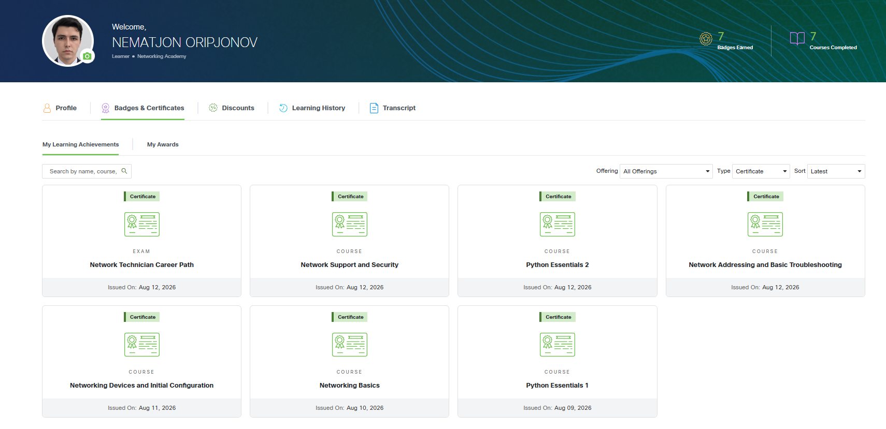

# Сертификаты и квалификации

Официальные сертификаты **Cisco Networking Academy**, полученные в августе 2026 года.

## Подтверждение профиля Cisco

*NEMATJON ORIPJONOV · 7 Badges Earned · 7 Courses Completed*

## Сертификаты

| # | Сертификат | Дата | PDF |
|---|---|---|---|
| 1 | Network Technician Career Path | 12.08.2026 | [PDF](cisco/network-technician-career-path.pdf) |
| 2 | Network Support and Security | 12.08.2026 | [PDF](cisco/network-support-and-security.pdf) |
| 3 | Python Essentials 2 | 12.08.2026 | [PDF](cisco/python-essentials-2.pdf) |
| 4 | Network Addressing and Basic Troubleshooting | 12.08.2026 | [PDF](cisco/network-addressing-and-basic-troubleshooting.pdf) |
| 5 | Networking Devices and Initial Configuration | 11.08.2026 | [PDF](cisco/networking-devices-and-initial-configuration.pdf) |
| 6 | Networking Basics | 10.08.2026 | [PDF](cisco/networking-basics.pdf) |

## Навыки, подтверждённые сертификатами

**Python:**
- ООП, модули, работа с файлами
- Обработка исключений
- Стандартная библиотека

**Сети:**
- Основы сетей (OSI, TCP/IP)
- Маршрутизация и коммутация
- Настройка сетевых устройств Cisco
- Диагностика и устранение неполадок
- Сетевая безопасность

## Об авторе

Telecom Engineer (Ташкент) · Python & C++ Developer · Автор учебника
«IoT и C++ для инженеров» (2 тома): [iot-cpp-books](https://github.com/nematjon555/iot-cpp-books)
